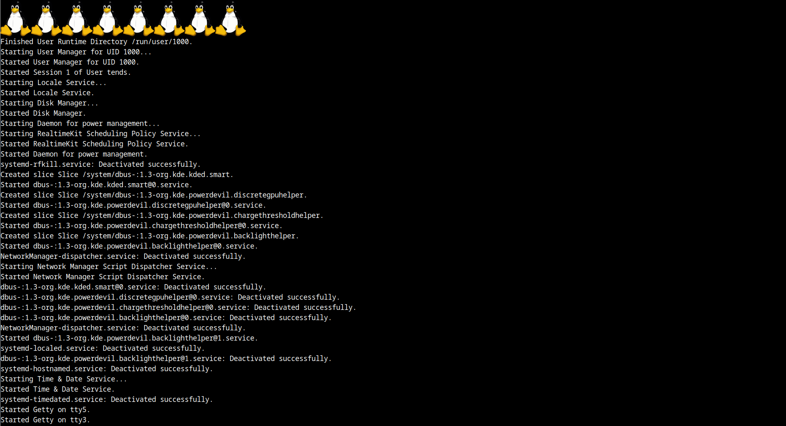

# plymouth-tuxes



a Plymouth theme that simulates the `CONFIG_LOGO` Linux boot screen, with tuxes on top.

## usage

clone this repository and place it in `/usr/share/plymouth/themes/plymouth-tuxes`. then run:

```
plymouth-set-default-theme -R tux
```

and follow the instructions in [this gist](https://gist.github.com/krzys-h/6ec7c7ca1c381c3a5546b1dd51bd68ca) to pass journalctl messages to plymouth (or replace the script with whatever content you want to send to the fake tty).

the script is hardcoded to show 8 tuxes, which you can change by setting `tux.count` in the `tux.script` file. you probably want this value to be the output of the `nproc` command for maximum realism.

## thanks

to plymouth for providing the sample `script` theme, which this uses as a base.

## license

GPLv2 license; see COPYING.txt.
